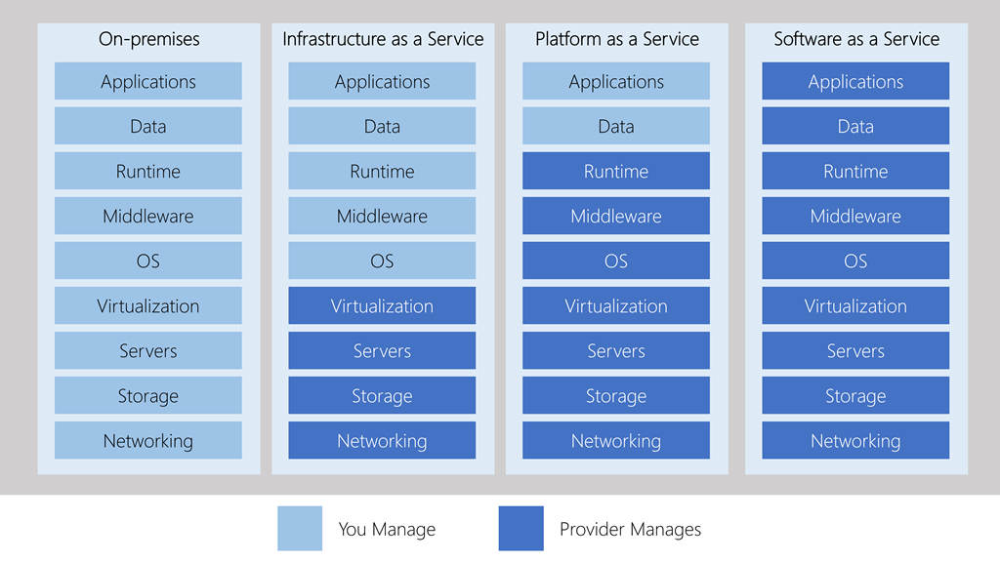

# cloud computing

## IaaS vs SaaS vs PaaS

### Infrastructure as a service (IaaS)
Infrastructure as a Service is the most flexible category of cloud services. It aims to give you the most control over the provided hardware that runs your application (IT infrastructure servers and virtual machines (VMs), storage, and operating systems). Instead of buying hardware, with IaaS, you rent it. It's an instant computing infrastructure, provisioned and managed over the internet.

### Platform as a service (PaaS)
PaaS provides an environment for building, testing, and deploying software applications. The goal of PaaS is to help you create an application quickly without managing the underlying infrastructure. For example, when deploying a web application using PaaS, you don't have to install an operating system, web server, or even system updates.

PaaS is a complete development and deployment environment in the cloud, with resources that enable organizations to deliver everything from simple cloud-based apps to sophisticated cloud-enabled enterprise applications. Resources are purchased from a cloud service provider on a pay-as-you-go basis and accessed over a secure Internet connection.

### Software as a service (SaaS)
SaaS is software that is centrally hosted and managed for the end customer. It is usually based on an architecture where one version of the application is used for all customers, and licensed through a monthly or annual subscription. Office 365, Skype, and Dynamics CRM Online are perfect examples of SaaS software.

### Microsoft Azure
[Microsoft Azure](https://azure.microsoft.com/overview/) is Microsoft's cloud computing platform. Azure provides over 100 services that enable you to do everything from running your existing applications on virtual machines to exploring new software paradigms such as intelligent bots and mixed reality.

Here are just a few kinds of services you'll find on Azure:

Compute services such as VMs and containers that can run your applications
Database services that provide both relational and NoSQL choices
Identity services that help you authenticate and protect your users
Networking services that connect your datacenter to the cloud, provide high availability or host your DNS domain
Storage solutions that can accommodate massive amounts of both structured and unstructured data
AI and machine-learning services can analyze data, text, images, comprehend speech, and make predictions using data — changing the world of agriculture, healthcare, and much more.
And many more!

To learn more about [Azure](https://docs.microsoft.com/learn/paths/azure-fundamentals/)

The Azure free account includes free access to popular Azure products for 12 months, $200 USD credit to spend for the first 30 days, and access to more than 25 products that are always free. This is an excellent way for new users to get started and explore. To sign up, you need a phone number, a credit card, and a Microsoft or GitHub account. Credit card information is used for identity verification only. You won't be charged for any services until you upgrade.

Free azure account https://azure.microsoft.com/en-us/free/